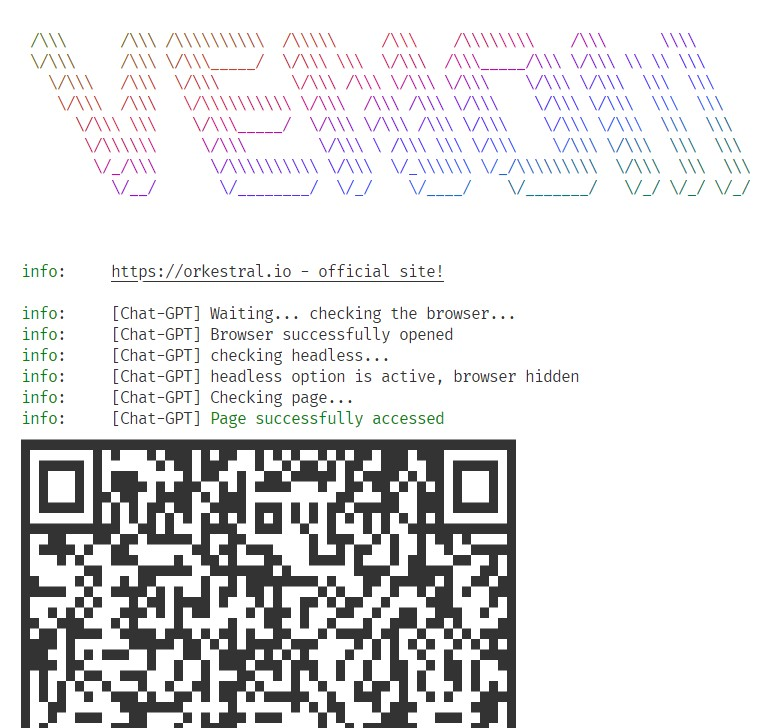
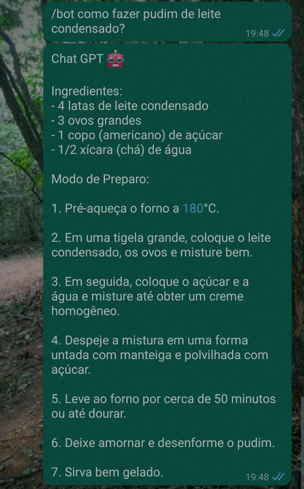

# 🟢 Whatschat GPT

Integração que permite o uso das IAs ChatGPT e DALL-e por meio de comandos no Whatsapp. Esta é uma cópia com algumas refatorações estruturais da implementação do [@victorharry](https://github.com/victorharry), que pode ser analisada em mais detalhes no artigo que ele liberou no [Tab News](https://www.tabnews.com.br/victorharry/guia-completo-de-como-integrar-o-chat-gpt-com-whatsapp).

## 🛠️ Tecnologias utilizadas

- [Node.js](https://nodejs.org/)
- [OpenAI](https://beta.openai.com/)
  - [ChatGPT](http://chat.openai.com/)
  - [DALL-e](https://openai.com/dall-e-2/)
- [Venom Bot](https://orkestral.io/)

## 🚀 Executando o projeto

1. Clone este projeto com o comando:
```bash
git clone https://github.com/lucasdemoraesc/whatschat-gpt3.git
```

2. Renomeie o arquivo [`.env.example`](./.env.example) para `.env` e em seguida altere os valores das variáveis de ambiente, onde:
   1. `OPENAI_KEY` representa sua API Key no OpenAI: https://beta.openai.com/account/api-keys
   2. `ORGANIZATION_ID` representa o ID da sua organização no OpenAI: https://beta.openai.com/account/org-settings
   3. `BOT_NUMBER` representa o número de celular utilizado pelo bot (Deve ser o mesmo utilizado para realizar o login ao iniciar a aplicação).

3. Instale as dependencias do projeto:
```bash
yarn install # Ou "npm install"
```

4. Execute a aplicação:
```bash
yarn start # Ou "npm start"
```

5. Aguarde o carregamento da aplicação, e escaneie o QR Code gerado com a função "Conectar um aparelho" do seu Whatsapp:


6. Utilize os comandos `/bot {mensagem}` e `/img {mensagem}` para interagir com as IAs ChatGPT e DALL-e, respectivamente.

|               ChatGPT               |              DALL-e               |
| :---------------------------------: | :-------------------------------: |
|  |  |
